# Game Concept — Brainrot Arcade Roguelite

A fast-paced single-player arcade roguelite that combines classic brick-breaker gameplay with chaotic build crafting, CRT visuals, internet humor, and escalating “brainrot” insanity.

The game begins as a clean retro arcade experience, but slowly mutates into an overstimulating corrupted nightmare full of absurd synergies, meme audio, fake system popups, glitch effects, and dopamine-fueled score explosions.

At its core, it is a highly replayable score-chasing game where players create overpowered builds using modifier cards while surviving increasingly chaotic levels.

Think:

* classic arcade brick breakers
* roguelite build crafting
* internet brainrot aesthetics
* CRT cyberpunk visuals
* sensory overload combo gameplay

all fused into one experience.

---

# Core Gameplay

Players control a paddle and bounce balls to destroy blocks and earn score multipliers.

Each stage contains:

* unique brick layouts
* score targets
* combo challenges
* special corrupted blocks
* mini-events or bosses

Destroying bricks increases score, combo chains, and resource gain.

At the end of every stage, players choose from randomized modifier cards that dramatically alter gameplay.

Over the course of a run, simple gameplay evolves into absurd chaos:

* multi-ball storms
* laser beams
* chain explosions
* physics-breaking effects
* corrupted UI
* overwhelming combo systems

The goal is not just survival — it is creating the most broken and satisfying build possible.

---

# The Build System

The game’s identity revolves around stacking ridiculous synergies.

Modifier cards can affect:

* balls
* paddle mechanics
* scoring systems
* brick behavior
* combo generation
* screen effects
* game rules themselves

Examples:

* Balls duplicate after combo chains
* Exploding bricks infect nearby blocks
* Tiny paddle but massive score multiplier
* Missed balls don’t kill you if combo meter is active
* Slow-motion activates during perfect streaks
* Balls ricochet infinitely at high speed
* Bricks regenerate but give bonus score
* Combo count affects gravity

The strongest builds become intentionally absurd and nearly uncontrollable.

Players are rewarded for discovering overpowered interactions between cards.

---

# Brainrot / Meme Identity

The game’s presentation is heavily inspired by modern internet culture and overstimulation aesthetics.

However, memes are not just random jokes — they are integrated directly into gameplay feedback and progression.

As runs progress, the game slowly “loses sanity.”

Early game:

* clean CRT arcade visuals
* calm retro atmosphere
* minimal UI

Mid game:

* distorted sounds
* fake notifications
* ironic announcer lines
* strange visual corruption

Late game:

* bass-boosted effects
* overwhelming combo popups
* fake livestream overlays
* distorted AI voice clips
* meme sound effects
* chaotic visual overload
* rapidly flashing score systems
* glitched menus
* absurd “aura” notifications
* corrupted desktop-style popups

The experience intentionally mirrors the feeling of modern algorithm-driven internet overstimulation.

The player is essentially watching the arcade machine become infected with terminal brainrot.

---

# Audio Design

Sound design plays a major role in the game’s identity.

Gameplay feedback includes:

* distorted arcade sounds
* meme sound effects
* bass-boosted impacts
* glitch noises
* AI-generated announcer voices
* fake system warnings
* ironic motivational lines

Big combos and synergies trigger exaggerated dopamine-heavy audio feedback.

The game should constantly make the player feel:

> “something ridiculous just happened.”

---

# Visual Style

The visual direction combines:

* retro CRT monitors
* neon arcade aesthetics
* VHS distortion
* scanlines
* chromatic aberration
* pixel-inspired UI
* glitch art
* internet-core overlays

The screen becomes progressively more unstable as runs intensify.

Visual effects are not only cosmetic — they communicate build strength and escalating insanity.

The overall style should feel like:

> an old arcade cabinet possessed by the modern internet.

---

# Progression & Replayability

Runs are short and replayable:

* 15–30 minute sessions
* randomized card drafts
* evolving synergies
* escalating difficulty
* unlockable cards/modifiers
* endless mode
* challenge runs
* score chasing

Players unlock:

* new card pools
* cursed modifiers
* alternate paddle types
* cosmetic CRT themes
* harder corruption levels
* new meme/event packs

The game is designed around:

* experimentation
* build discovery
* combo optimization
* chaotic fun
* replayability

---

# Overall Identity

The game is not trying to be a serious competitive experience.

It is designed to feel:

* stylish
* addictive
* chaotic
* funny
* satisfying
* highly streamable
* visually memorable

Underneath the humor and brainrot presentation is a genuinely strategic arcade roguelite with deep synergy-building mechanics.

The player starts with a simple paddle and ball…

…and ends the run inside a collapsing neon fever dream where explosions, meme audio, corrupted UI, and impossible score chains consume the screen.


implementation plan

# Brainrot Arcade Roguelite — Implementation Plan

## Current State Assessment

### What Exists (✅)
| Feature | Status | Quality |
|---|---|---|
| Basic paddle + ball physics | ✅ Working | ⚠️ Bare minimum — single ball only |
| Brick grid generation | ✅ Working | ⚠️ Simple random grid, no layouts |
| Brick HP system | ✅ Working | ✅ OK |
| Collision detection | ✅ Working | ⚠️ Basic AABB, occasional tunneling |
| Score + combo counter | ✅ Working | ⚠️ Combo only increments on paddle hit, no decay/chain |
| 3-stage progression | ✅ Working | ⚠️ Hardcoded to 3 stages only |
| Card selection screen | ✅ Working | ⚠️ Only 3/6 cards have effects implemented |
| Scanline CRT overlay | ✅ Working | ⚠️ Very minimal — just horizontal lines |
| Screen shake | ✅ Working | ✅ OK |
| Sound effects (3 sounds) | ✅ Working | ⚠️ Very limited audio |
| Custom paddle image | ✅ Working | ✅ OK |
| Fullscreen toggle | ✅ Working | ✅ OK |
| Game over / Victory screens | ✅ Working | ⚠️ Plain text only |

### What's Missing (❌) — Gap Analysis

#### 🔴 Critical (Core Gameplay)
| Feature | README Spec | Current State |
|---|---|---|
| Multi-ball system | "multi-ball storms" | ❌ Single ball only, no infrastructure |
| Modifier card effects | 6 cards listed, many more described | ❌ Only 3 of 6 cards actually do anything |
| Combo chain system | "combo chains", "combo meter" | ❌ Combo only +1 on paddle hit, no chains/decay |
| Score targets per stage | "score targets" per stage | ❌ No targets, just clear all bricks |
| Special/corrupted blocks | "special corrupted blocks" | ❌ Only HP-based bricks |
| Exploding brick propagation | "Exploding bricks infect neighbors" | ❌ Card exists but no effect |
| Ghost ball mechanic | "Balls pass through bricks once" | ❌ Card exists but no effect |
| Ball speed escalation | "Balls ricochet infinitely at high speed" | ❌ Fixed speed |
| Paddle death mechanic | "Missed balls don't kill you if combo meter is active" | ⚠️ Partially — combo > 0 gives free miss, but no meter |

#### 🟡 Important (Build System & Identity)
| Feature | README Spec | Current State |
|---|---|---|
| Card pool expansion | "new card pools", many example effects | ❌ Only 6 cards total |
| Card synergies | "discovering overpowered interactions" | ❌ Cards don't interact |
| Active modifiers tracking | Players stack cards across stages | ❌ Cards are fire-and-forget |
| Laser beams | Listed as core mechanic | ❌ Not implemented |
| Chain explosions | Listed as core mechanic | ❌ Not implemented |
| Physics-breaking effects | Listed as core mechanic | ❌ Not implemented |
| Gravity affected by combo | Explicit example | ❌ Not implemented |
| Slow-motion on perfect streaks | Explicit example | ❌ Not implemented |
| Brick regeneration | "Bricks regenerate but give bonus score" | ❌ Not implemented |

#### 🟠 Major (Brainrot Escalation System)
| Feature | README Spec | Current State |
|---|---|---|
| Progressive sanity loss | Entire section on escalation | ❌ Only a red overlay tint |
| Distorted sounds | Mid-game effect | ❌ Not implemented |
| Fake notifications/popups | Mid+Late game effect | ❌ Not implemented |
| Ironic announcer lines | Mid-game effect | ❌ Not implemented |
| Bass-boosted effects | Late-game effect | ❌ Not implemented |
| Overwhelming combo popups | Late-game effect | ❌ Not implemented |
| Fake livestream overlays | Late-game effect | ❌ Not implemented |
| Glitched menus | Late-game effect | ❌ Not implemented |
| "Aura" notifications | Late-game effect | ❌ Not implemented |
| Corrupted desktop-style popups | Late-game effect | ❌ Not implemented |
| Corrupted UI distortion | Late-game effect | ❌ Not implemented |

#### 🔵 Visual Polish
| Feature | README Spec | Current State |
|---|---|---|
| CRT shader effects | "retro CRT monitors" | ❌ Only basic scanlines |
| Chromatic aberration | Explicitly listed | ❌ Not implemented |
| VHS distortion | Explicitly listed | ❌ Not implemented |
| Neon arcade aesthetics | Explicitly listed | ❌ Flat colors, no glow |
| Glitch art effects | Explicitly listed | ❌ Not implemented |
| Pixel-inspired UI | Explicitly listed | ❌ Default LÖVE font |
| Internet-core overlays | Explicitly listed | ❌ Not implemented |
| Particle effects | Implied by "explosions" | ❌ None |
| Ball trail effects | Common in arcade games | ❌ None |
| Brick destruction animation | "satisfying" gameplay | ❌ Bricks just disappear |
| Combo popup text | Score feedback | ❌ None |

#### 🟣 Progression & Meta
| Feature | README Spec | Current State |
|---|---|---|
| 15-30 min run length | Spec says short runs | ⚠️ 3 stages is ~2 minutes |
| Unlockable cards/modifiers | Explicitly listed | ❌ Not implemented |
| Endless mode | Explicitly listed | ❌ Not implemented |
| Challenge runs | Explicitly listed | ❌ Not implemented |
| Alternate paddle types | Explicitly listed | ❌ Not implemented |
| Cosmetic CRT themes | Explicitly listed | ❌ Not implemented |
| Harder corruption levels | Explicitly listed | ❌ Not implemented |
| New meme/event packs | Explicitly listed | ❌ Not implemented |
| Persistent high scores | Implied by score chasing | ❌ Not implemented |
| Main menu | Standard game UI | ❌ Game starts directly |
| Pause menu | Standard game UI | ❌ Not implemented |
| Settings screen | Standard game UI | ❌ Not implemented |

#### 🔘 Code Quality Issues
| Issue | Description |
|---|---|
| Monolithic file | All 416 lines in one `main.lua` |
| No module system | No separation of concerns |
| Global state | Everything is global or file-level local |
| No entity system | Ball is a single table, can't support multi-ball |
| No particle system | No LÖVE particle system usage |
| No shader pipeline | No LÖVE shader usage |
| No state machine | Game states are basic if/else |
| No config/constants | Magic numbers throughout |
| No save/load system | No persistence |

---

## Implementation Roadmap

### Phase 1: Core Engine Refactor 🏗️
> **Goal:** Restructure the codebase for extensibility. Nothing new visible to the player yet, but everything becomes possible.

| # | Task | Description | Effort | Priority |
|---|---|---|---|---|
| 1.1 | **Module architecture** | Split into modules: `conf.lua`, `entities/ball.lua`, `entities/paddle.lua`, `entities/brick.lua`, `systems/collision.lua`, `systems/physics.lua`, `states/playing.lua`, `states/menu.lua`, `states/cardselect.lua`, `states/gameover.lua`, `ui/hud.lua`, `data/cards.lua`, `effects/particles.lua`, `effects/shaders.lua`, `effects/brainrot.lua` | 🔵 Large | 🔴 P0 |
| 1.2 | **Entity list system** | Replace single `ball` table with `balls = {}` list. All ball logic iterates over the list. Same pattern for particles, popups, etc. | 🟢 Medium | 🔴 P0 |
| 1.3 | **Game state machine** | Proper state machine with `enter()`, `exit()`, `update()`, `draw()` per state. Add `STATE_MENU`, `STATE_PAUSE`. | 🟢 Medium | 🔴 P0 |
| 1.4 | **Constants & config** | Extract all magic numbers to `conf.lua`: speeds, sizes, colors, timings. | 🟢 Small | 🟡 P1 |
| 1.5 | **Active modifiers system** | Track `activeModifiers = {}` list. Cards add to this. Game systems check modifier flags each frame. | 🟢 Medium | 🔴 P0 |
| 1.6 | **Timer/tween utility** | Simple timer system for delayed events, tweens for animations. | 🟢 Small | 🟡 P1 |

### Phase 2: Build System & Card Overhaul 🃏
> **Goal:** The card/modifier system becomes the game's identity. Deep, synergistic, chaotic.

| # | Task | Description | Effort | Priority |
|---|---|---|---|---|
| 2.1 | **Implement all 6 existing card effects** | `multiball` → spawn 2 extra balls on combo 10. `ghostBall` → ball passes through 1 brick without bouncing. `exploding` → on brick death, damage adjacent bricks. | 🟢 Medium | 🔴 P0 |
| 2.2 | **Expand card pool to 15+** | Add: Laser Paddle, Gravity Flip, Magnet Ball, Shield Row, Score Frenzy, Slow-Mo Zone, Ricochet Master, Brick Regen, Combo Gravity, Speed Demon, Mega Ball, Phantom Paddle, Chain Lightning. | 🔵 Large | 🔴 P0 |
| 2.3 | **Card rarity system** | Common / Rare / Legendary tiers. Visual distinction. Weighted draw from pool. | 🟢 Medium | 🟡 P1 |
| 2.4 | **Synergy detection** | When player picks cards that synergize, show a "SYNERGY DISCOVERED!" popup. Track known synergy pairs. | 🟢 Medium | 🟡 P1 |
| 2.5 | **Active modifiers HUD** | Show icons/names of all active modifiers on screen during gameplay. | 🟢 Small | 🔴 P0 |
| 2.6 | **Card visual upgrade** | Cards with glow borders, rarity colors, hover animations, pixel art icons. | 🟢 Medium | 🟡 P1 |

### Phase 3: Brainrot Escalation System 🧠💀
> **Goal:** The game progressively "loses its mind." This is the game's signature feature.

| # | Task | Description | Effort | Priority |
|---|---|---|---|---|
| 3.1 | **Brainrot level system** | `brainrotLevel` drives ALL escalation effects. Increases on stage clear, big combos, certain cards. Scale from 0-10. | 🟢 Small | 🔴 P0 |
| 3.2 | **Early game (level 0-2)** | Clean CRT arcade look. Minimal UI. Calm retro feel. This is the baseline — make it look GOOD. | 🟢 Medium | 🔴 P0 |
| 3.3 | **Mid game (level 3-5)** | Introduce: distorted sounds (pitch shift), fake notification popups ("Your combo is on FIRE 🔥"), ironic text overlays, slight visual corruption (random pixel offset). | 🔵 Large | 🔴 P0 |
| 3.4 | **Late game (level 6-8)** | Bass-boosted sound effects, overwhelming combo popups filling screen, fake "LIVE" streaming overlay, meme sound effects on big combos, "AURA +1000" notifications, rapid score counter animations. | 🔵 Large | 🟡 P1 |
| 3.5 | **Endgame (level 9-10)** | Fake desktop popups ("Your PC has a virus!"), corrupted glitch menu overlays, distorted AI voice clips, screen tearing effects, RGB cycling everything, complete visual chaos. | 🔵 Large | 🟡 P1 |
| 3.6 | **Popup/notification system** | Reusable system for spawning floating text, fake notifications, "achievement" banners. They stack, overlap, and escalate with brainrot level. | 🟢 Medium | 🔴 P0 |

### Phase 4: Audio Design 🔊
> **Goal:** Sound that makes the player feel "something ridiculous just happened."

| # | Task | Description | Effort | Priority |
|---|---|---|---|---|
| 4.1 | **Expand sound library** | Add: brick break variations, combo milestone sounds, card select chime, menu sounds, victory fanfare, escalating impact sounds. | 🟢 Medium | 🔴 P0 |
| 4.2 | **Dynamic pitch/volume** | Pitch and volume scale with combo count and brainrot level. Higher combo = more distorted. | 🟢 Small | 🔴 P0 |
| 4.3 | **Bass boost system** | At high brainrot, apply bass boost / distortion to all sounds. | 🟢 Medium | 🟡 P1 |
| 4.4 | **Meme sound triggers** | At specific combo thresholds or events, play meme sounds (vine boom, air horn, etc). | 🟢 Medium | 🟡 P1 |
| 4.5 | **Background music** | Looping retro-arcade music that gets progressively more distorted with brainrot. | 🟢 Medium | 🟡 P1 |

### Phase 5: Visual Polish & Effects ✨
> **Goal:** Transform from "programmer art" to "possessed arcade cabinet."

| # | Task | Description | Effort | Priority |
|---|---|---|---|---|
| 5.1 | **CRT shader** | Full CRT shader: barrel distortion, phosphor glow, proper scanlines, vignette, RGB separation. Use LÖVE's shader system. | 🔵 Large | 🔴 P0 |
| 5.2 | **Chromatic aberration shader** | RGB channel offset that increases with brainrot level. | 🟢 Medium | 🟡 P1 |
| 5.3 | **Particle system** | LÖVE ParticleSystem for: brick destruction (debris), ball trail, paddle hit sparks, combo fire, explosion effects. | 🔵 Large | 🔴 P0 |
| 5.4 | **Neon glow effects** | Bloom/glow on ball, paddle, active bricks. Achieved via additive blending and blurred copies. | 🟢 Medium | 🟡 P1 |
| 5.5 | **Brick destruction animation** | Bricks shatter into pieces, flash white, then fade. Not just disappear. | 🟢 Medium | 🔴 P0 |
| 5.6 | **Combo text popups** | Floating "+100", "COMBO x5!", "INSANE!" text that scales, rotates, and fades out. | 🟢 Medium | 🔴 P0 |
| 5.7 | **Screen flash on big events** | White/colored flash on screen for big combo milestones, brick clears, etc. | 🟢 Small | 🟡 P1 |
| 5.8 | **VHS distortion overlay** | Horizontal line glitches, color banding, tracking errors. Increase with brainrot. | 🟢 Medium | 🟡 P1 |
| 5.9 | **Pixel font** | Use a proper pixel/retro font instead of default LÖVE font. | 🟢 Small | 🔴 P0 |
| 5.10 | **Ball trail** | Fading trail behind the ball using previous positions or particles. | 🟢 Small | 🟡 P1 |

### Phase 6: Progression, Meta & UI 📊
> **Goal:** Give players reasons to come back. Make the game feel complete.

| # | Task | Description | Effort | Priority |
|---|---|---|---|---|
| 6.1 | **Main menu** | Title screen with: Start Run, Endless Mode, Settings, Quit. CRT aesthetic, animated title. | 🟢 Medium | 🔴 P0 |
| 6.2 | **Pause menu** | Pause with Resume, Settings, Quit to Menu. Overlay with blur/dim. | 🟢 Small | 🔴 P0 |
| 6.3 | **Settings screen** | Volume, fullscreen, CRT effect toggle, screen shake toggle. | 🟢 Medium | 🟡 P1 |
| 6.4 | **Expand to 10+ stages** | More stages with unique brick layouts (patterns, shapes, boss formations). | 🔵 Large | 🔴 P0 |
| 6.5 | **Stage-specific layouts** | Hand-designed brick patterns: diamond, skull, spiral, walls, fortress, etc. | 🟢 Medium | 🟡 P1 |
| 6.6 | **Score targets per stage** | Each stage has a target score. Beating it gives bonus cards/rewards. | 🟢 Small | 🟡 P1 |
| 6.7 | **High score persistence** | Save/load high scores to file. Show on main menu and game over screen. | 🟢 Small | 🟡 P1 |
| 6.8 | **Endless mode** | After beating all stages, game continues with escalating difficulty and brainrot. | 🟢 Medium | 🟡 P1 |
| 6.9 | **Run summary screen** | After game over / victory, show: cards picked, combos hit, peak combo, bricks destroyed, brainrot level reached. | 🟢 Medium | 🟡 P1 |
| 6.10 | **Unlockable card pools** | Certain cards unlock after achieving milestones (score thresholds, stage clears). | 🟢 Medium | 🟠 P2 |

### Phase 7: Final Polish & Juice 🎯
> **Goal:** Make every interaction feel incredible.

| # | Task | Description | Effort | Priority |
|---|---|---|---|---|
| 7.1 | **Improved collision** | Better ball-brick collision to prevent tunneling at high speeds. Swept collision or substeps. | 🟢 Medium | 🟡 P1 |
| 7.2 | **Ball speed management** | Cap maximum speed, add speed curves, prevent ball getting stuck in horizontal loops. | 🟢 Small | 🔴 P0 |
| 7.3 | **Combo decay system** | Combo slowly decays over time if no bricks are hit. Adds tension. | 🟢 Small | 🟡 P1 |
| 7.4 | **Mini-bosses** | Special stages with a "boss brick" that has massive HP, moves, or fights back. | 🔵 Large | 🟠 P2 |
| 7.5 | **Gamepad support** | Controller input for paddle movement and menu navigation. | 🟢 Small | 🟠 P2 |
| 7.6 | **Performance optimization** | Object pooling, efficient particle management, draw call batching. | 🟢 Medium | 🟡 P1 |

---

## Suggested Implementation Order

```mermaid
gantt
    title Brainrot Arcade — Build Order
    dateFormat  X
    axisFormat %s

    section Phase 1 - Engine
    Module architecture           :p1_1, 0, 3
    Entity list system            :p1_2, 0, 2
    Game state machine            :p1_3, 0, 2
    Active modifiers system       :p1_5, after p1_1, 2
    Constants & config            :p1_4, after p1_1, 1
    Timer/tween utility           :p1_6, after p1_1, 1

    section Phase 2 - Cards
    Implement existing card fx    :p2_1, after p1_5, 2
    Expand card pool              :p2_2, after p2_1, 3
    Active modifiers HUD          :p2_5, after p2_1, 1
    Card rarity system            :p2_3, after p2_2, 2
    Card visuals                  :p2_6, after p2_3, 2

    section Phase 5 - Visuals
    Pixel font                    :p5_9, after p1_1, 1
    Particle system               :p5_3, after p1_2, 2
    Brick death animation         :p5_5, after p5_3, 1
    Combo text popups             :p5_6, after p5_3, 1
    CRT shader                    :p5_1, after p1_1, 3
    Ball trail                    :p5_10, after p5_3, 1
    Neon glow                     :p5_4, after p5_1, 2

    section Phase 3 - Brainrot
    Brainrot level system         :p3_1, after p1_5, 1
    Popup/notification system     :p3_6, after p5_6, 2
    Early game polish             :p3_2, after p5_1, 2
    Mid game effects              :p3_3, after p3_6, 3
    Late game effects             :p3_4, after p3_3, 3

    section Phase 6 - Meta
    Main menu                     :p6_1, after p5_9, 2
    Pause menu                    :p6_2, after p6_1, 1
    Expand stages                 :p6_4, after p2_2, 2
    High scores                   :p6_7, after p6_1, 1
    Endless mode                  :p6_8, after p6_4, 2
```



---

## File Structure (Target)

```
luagame/
├── main.lua                  # Entry point, love callbacks
├── conf.lua                  # LÖVE config + game constants
├── entities/
│   ├── ball.lua              # Ball class (supports multi-ball)
│   ├── paddle.lua            # Paddle class
│   └── brick.lua             # Brick class + special types
├── systems/
│   ├── collision.lua          # Collision detection & resolution
│   ├── physics.lua            # Ball physics, speed management
│   └── modifiers.lua          # Active modifier application
├── states/
│   ├── statemachine.lua       # State machine manager
│   ├── menu.lua               # Main menu
│   ├── playing.lua            # Core gameplay state
│   ├── cardselect.lua         # Card selection between stages
│   ├── gameover.lua           # Game over screen
│   ├── victory.lua            # Victory screen
│   └── pause.lua              # Pause overlay
├── ui/
│   ├── hud.lua                # In-game HUD (score, combo, modifiers)
│   └── popup.lua              # Floating text, notifications, fake popups
├── data/
│   ├── cards.lua              # Card pool definitions
│   ├── layouts.lua            # Hand-designed brick layouts
│   └── synergies.lua          # Synergy pair definitions
├── effects/
│   ├── particles.lua          # Particle system manager
│   ├── shaders.lua            # CRT, chromatic aberration, glitch shaders
│   ├── brainrot.lua           # Brainrot escalation controller
│   └── camera.lua             # Screen shake, flash, zoom
├── lib/
│   ├── timer.lua              # Timer/tween utility
│   └── save.lua               # Save/load high scores
├── assets/
│   ├── sahur.png              # Paddle image
│   ├── fonts/                 # Pixel fonts
│   └── sprites/               # UI sprites, card art, icons
└── sounds/
    ├── bonk.mp3
    ├── punch.mp3
    ├── fah.mp3
    └── ...                    # Additional SFX
```

---

## Quality Improvements Needed on Current Code

> [!WARNING]
> These issues make the current game feel like a prototype, not a product.

1. **No visual feedback on brick hit** — bricks just lose HP silently (no flash, no particle, no sound variation)
2. **Ball feels lifeless** — no trail, no glow, no impact effect
3. **Paddle is a static image** — no tilt on movement, no hit animation
4. **UI is plain text** — default font, no styling, no animation
5. **Card select is ugly** — flat colored rectangles, no hover/select animation
6. **Game over / Victory screens are placeholder** — just text on a colored background
7. **No background visuals** — just a flat color
8. **CRT effect is minimal** — just faint horizontal lines
9. **No combo feedback** — hitting combo milestones does nothing special
10. **Only 3 stages** — game is over in ~2 minutes
11. **Sound design is minimal** — only 3 sounds, no variation, no dynamics
12. **Ball can get stuck** — no anti-stuck mechanism for near-horizontal bouncing

---

## Summary

> [!IMPORTANT]
> The current implementation covers roughly **15-20% of the README spec**. The core paddle-ball-brick loop works, but virtually all of the game's identity — the build system, brainrot escalation, visual style, audio design, and meta-progression — is unimplemented.

**Immediate next steps should be:**
1. **Phase 1** (Engine Refactor) — Without this, adding features will be painful
2. **Phase 5.9** (Pixel Font) + **Phase 5.3** (Particles) — Instant visual upgrade
3. **Phase 2.1** (Fix existing cards) — Make the card system actually work
4. **Phase 5.1** (CRT Shader) — Defines the game's visual identity

Would you like me to start implementing any of these phases?
